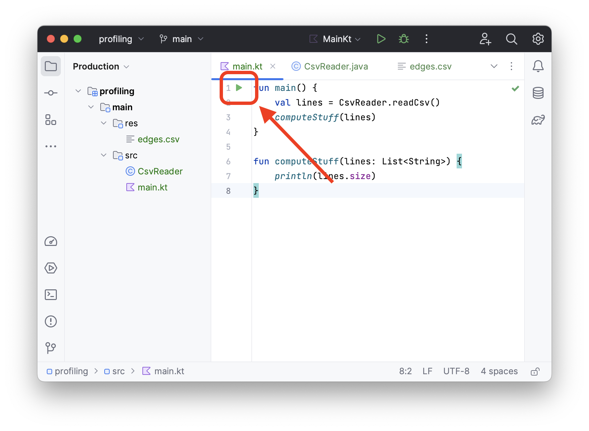
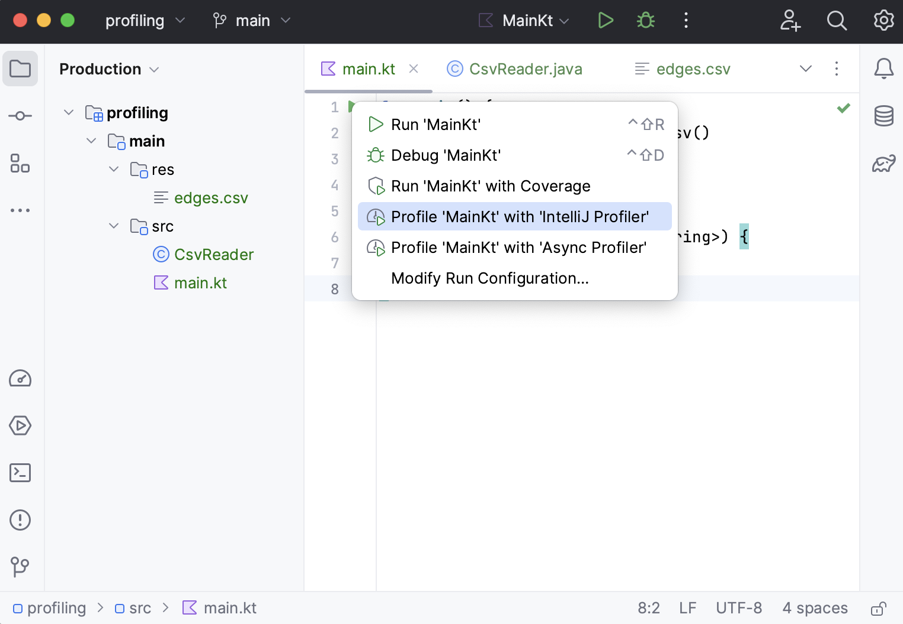
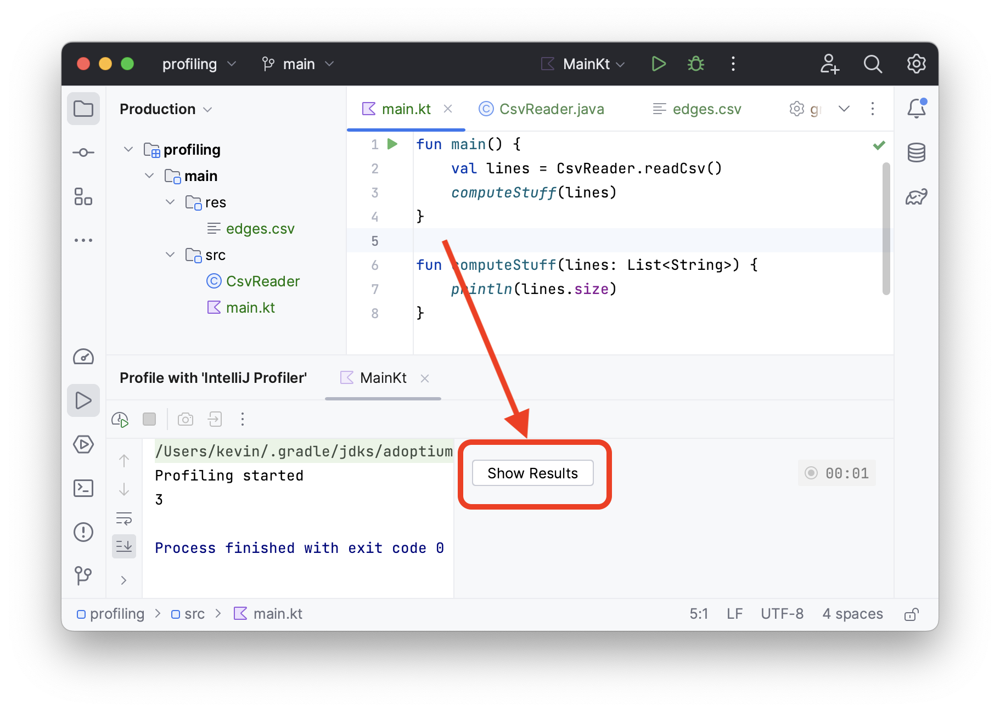
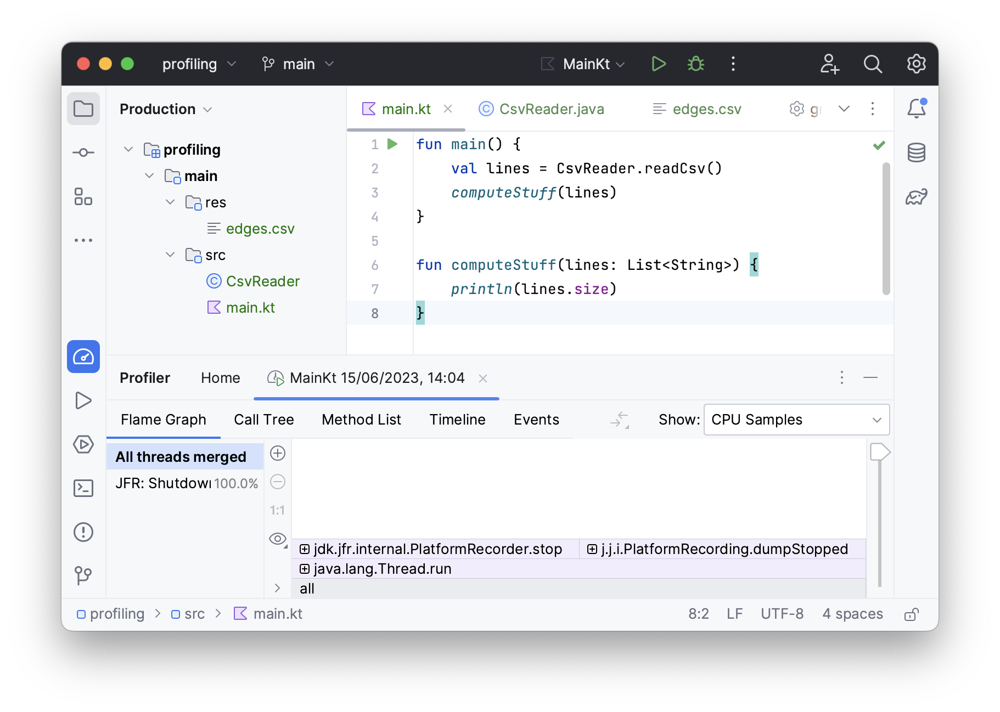

## Profiler Workshop

### Setup
1. Open this project in IntelliJ.
To ensure that IntelliJ has loaded it properly, a green play button should appear in the `main.kt` file.

2. Click this play button, and make sure there is an option to `Profile 'MainKt' with 'IntelliJ Profiler'`.
Click on this option to run the profiler.

3. You should get a notification that the profiling ran successfully.
This notification can be short-lived, so click on `Show Results` to see the profiler results

4. You should see something like the following as the results of the profiler.

